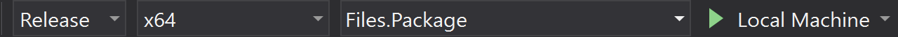

# Building Files from source

1. Install Microsoft Visual Studio and the UWP Development kit.
2. Clone the [repository](https://github.com/files-community/files) and open `Files.sln` in VS
3. Make sure that `Files.Package` is set as the startup item
4. Run `Files.Package, x64` as `Debug` and it should look like this:

5. You're good to go!
